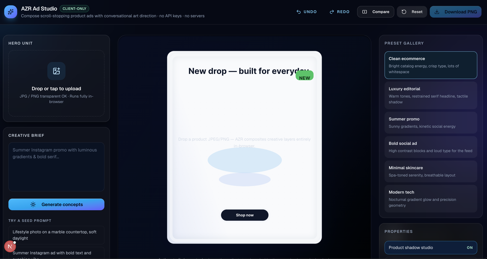

# 🎨 AZR Ad Studio — AI-Powered Product Ad Generator (Frontend-Only)

Create scroll-stopping product ads in seconds using conversational art direction.

👉 Live Demo: https://ad-studio-two.vercel.app/



---

## 🚀 Overview

Ad Studio is a lightweight, frontend-only AI-inspired creative tool that transforms a product image and a simple prompt into a polished ad concept.

Instead of relying on expensive APIs, the app simulates **agentic AI behavior** through smart prompt interpretation, design heuristics, and dynamic canvas composition — all running entirely in the browser.

---

## ✨ Features

- 🖼️ Upload product images (JPG/PNG)
- 💬 Natural language prompts ("summer Instagram ad", "luxury skincare vibe")
- 🤖 Smart prompt interpretation (simulated AI planning)
- 🎯 Auto-generated ad compositions
- 🎨 Interactive canvas editor (drag, resize, text, CTA)
- 🔁 Chat-based iteration ("make it warmer", "add headline")
- 🎭 Preset styles:
  - Clean ecommerce
  - Luxury editorial
  - Summer promo
  - Bold social ad
  - Minimal skincare
  - Modern tech
- 📦 Export final design as PNG
- ⚡ Fully client-side — zero API cost

---

## 🧠 Key Idea

> You don’t need expensive AI to create value — you need good product thinking.

This project focuses on:
- Translating vague user intent into structured design decisions
- Creating the *feeling* of intelligence through UX
- Delivering fast, interactive feedback loops

---

## 🏗️ Tech Stack

- **Next.js (App Router)**
- **TypeScript**
- **Tailwind CSS**
- **Fabric.js** (canvas editor)
- **Zustand** (state management)
- **Framer Motion** (micro-interactions)

---

## 🧩 How It Works

1. User uploads a product image
2. User enters a prompt
3. The app converts the prompt into a structured "design plan":
   - Theme
   - Color palette
   - Layout
   - Typography
4. The canvas dynamically composes:
   - Background
   - Product placement
   - Headline
   - CTA
   - Shadows & effects
5. User iterates via chat → updates applied instantly

---

## 🎯 Why This Is Interesting

- No backend
- No API keys
- No paid AI usage
- Still feels like an intelligent system

This showcases:
- Product thinking
- UX design
- Creative engineering
- Agentic system simulation

---

## 🖥️ Local Setup

```bash
git clone https://github.com/alizahidraja/Ad-studio.git
cd ad-studio
npm install
npm run dev